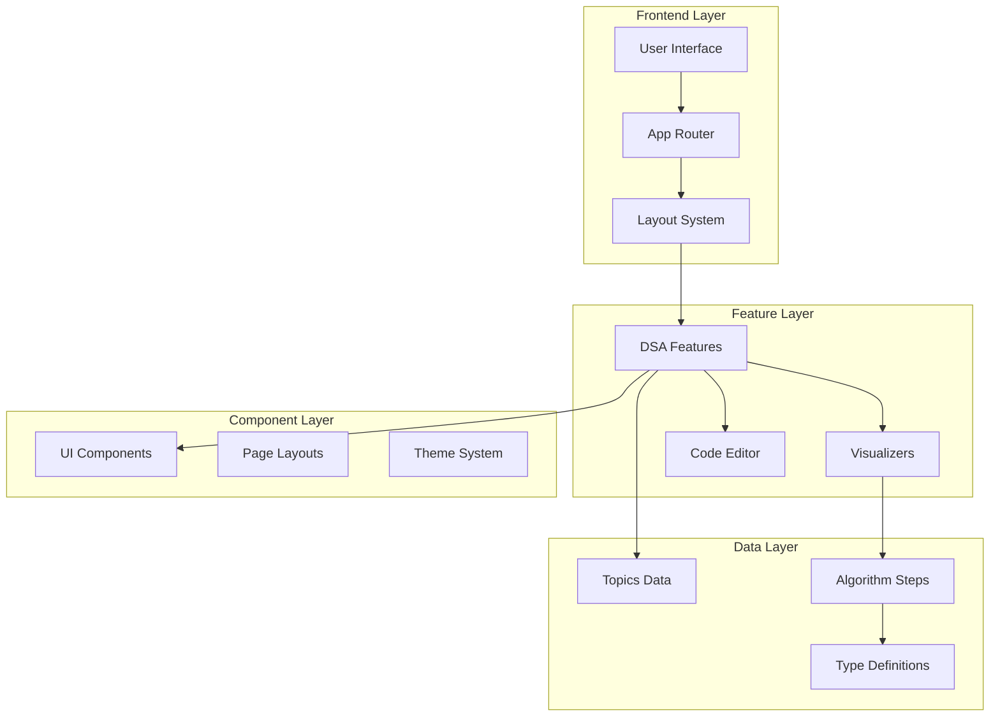

# DSA Playground

> Interactive Data Structures and Algorithms visualization platform with educational problems and real-time code execution.


## 🏗️ Architecture Overview

### **System Architecture**



## 🔧 Technology Stack

### **Core Technologies**
- **Framework**: Next.js 16.0.0 (App Router)
- **Language**: TypeScript 5.3.3
- **Styling**: Tailwind CSS 4.1.18
- **UI Library**: Radix UI + Custom components
- **Code Editor**: Monaco Editor (VS Code editor)
- **Code Parsing**: Acorn + AST manipulation
- **Icons**: Lucide React
- **Animations**: Framer Motion

### **Developer Tools**
- **Linting**: ESLint + Next.js config
- **Formatting**: Prettier
- **Type Checking**: TypeScript strict mode
- **Build Tool**: Next.js with Turbopack

### **Architecture Patterns**
- **Feature-based Architecture**: Modular organization by domain
- **Component Composition**: Reusable UI building blocks
- **Static Data Management**: Type-safe topic/problem definitions
- **Route Groups**: Organized routing with shared layouts

## 🚀 Features

### **✅ Implemented Features**
1. **Algorithm Visualizations**
   - Binary Search with step-by-step execution
   - Two Sum problem with hash map visualization
   - Tree traversal (in-order, pre-order, post-order)
   - Linked list operations (reverse, manipulation)
   - String search algorithms (KMP, Boyer-Moore patterns)

2. **Interactive Learning Environment**
   - Real-time code editor with Monaco Editor
   - Step-by-step algorithm execution
   - Visual feedback and data structure changes
   - Playback controls (play, pause, step, speed adjustment)

3. **User Interface**
   - Modern dashboard with topic cards
   - Responsive design with dark/light theme
   - Hierarchical navigation (topic → pattern → problem)
   - Breadcrumb navigation system
   - Consistent page layouts with PageLayout component

4. **Data Organization**
   - Type-safe data structures for topics, patterns, problems
   - Centralized data management
   - Extensible schema for new algorithms

## Getting Started

### Prerequisites

- Node.js 18 or later
- npm or yarn

### Installation

1. Clone the repository:
```bash
git clone <repository-url>
cd dsa-playground
```

2. Install dependencies:
```bash
npm install
```

3. Run the development server:
```bash
npm run dev
```

4. Open [http://localhost:3001](http://localhost:3001) in your browser

## Development

### Available Scripts

- `npm run dev` - Start development server on port 3001
- `npm run build` - Build for production
- `npm run start` - Start production server
- `npm run lint` - Run ESLint
- `npm run lint:fix` - Fix ESLint issues automatically
- `npm run format` - Format code with Prettier

### **Project Structure**

```
src/
├── app/(dsa)/                          # App Router with route groups
│   ├── layout.tsx                      # DSA-specific layout with sidebar
│   ├── page.tsx                        # Dashboard with topic cards
│   ├── problems/                       # Problems listing page
│   ├── [topic]/                        # Dynamic topic routes
│   │   ├── page.tsx                    # Topic overview page
│   │   └── [pattern]/                  # Dynamic pattern routes
│   │       ├── page.tsx                # Pattern problems list
│   │       └── [problemId]/            # Dynamic problem routes
│   │           └── page.tsx            # Individual problem solver
│   └── analytics/                      # Analytics page (future)
│
├── components/                         # Reusable UI components
│   ├── layout/
│   │   └── PageLayout.tsx              # Consistent page layout wrapper
│   ├── theme-provider.tsx              # Theme context provider
│   └── ui/                             # Shadcn/ui components
│       ├── button.tsx
│       ├── data-table.tsx
│       ├── dropdown-menu.tsx
│       └── theme-switcher.tsx
│
├── features/dsa/                       # DSA-specific feature module
│   ├── algorithms/                     # Algorithm step definitions
│   │   ├── binarySearchSteps.ts
│   │   ├── treeTraversalSteps.ts
│   │   ├── twoSumSteps.ts
│   │   └── ...
│   ├── components/                     # DSA-specific components
│   │   ├── sidebar/
│   │   │   └── DsaSidebar.tsx
│   │   └── topic-card/
│   │       └── TopicCard.tsx
│   ├── controls/
│   │   └── Controls.tsx                # Playback controls
│   ├── data/
│   │   └── topics.ts                   # Static data structure
│   ├── editor/
│   │   └── CodeEditor.tsx              # Monaco editor wrapper
│   ├── pages/
│   │   └── DsaPlaygroundPage.tsx       # Main playground component
│   ├── types/
│   │   └── step.ts                     # Type definitions
│   └── visualizer/                     # Algorithm visualizers
│       ├── ArrayVisualizer.tsx
│       ├── TreeVisualizer.tsx
│       ├── TwoSumVisualizer.tsx
│       └── ...
│
└── lib/                                # Utility libraries
    └── utils.ts                        # Helper functions
```

## ⚠️ Scalability Issues & Solutions

### **Current Scalability Challenges**

#### 1. **Static Data Management**
**Problem**: All topics/problems defined in a single static file
```typescript
// Current approach - not scalable
export const dsaTopics: Topic[] = [/* hardcoded data */];
```
**Impact**:
- Difficult to add new problems
- No content management capability
- Hard to maintain as data grows

**Solutions**:
```typescript
// Option 1: Database Integration
interface TopicRepository {
  getTopics(): Promise<Topic[]>;
  getTopic(id: string): Promise<Topic>;
  createProblem(topicId: string, problem: Problem): Promise<void>;
}

// Option 2: CMS Integration (Contentful/Sanity)
const client = createClient({
  space: process.env.CONTENTFUL_SPACE_ID,
  accessToken: process.env.CONTENTFUL_ACCESS_TOKEN,
});

// Option 3: File-based CMS (MDX)
export async function getStaticProps() {
  const topics = await loadTopicsFromMDX();
  return { props: { topics } };
}
```

#### 2. **Algorithm Step Definitions**
**Problem**: Manual step-by-step algorithm definitions
```typescript
// Current approach - labor intensive
export const binarySearchSteps = [
  { action: 'initialize', data: {...} },
  { action: 'compare', data: {...} },
  // ... manually defined steps
];
```
**Impact**:
- Time-intensive to create new visualizations
- Inconsistent step formats
- No automatic step generation

**Solutions**:
```typescript
// Algorithm execution framework
interface AlgorithmExecutor<T> {
  execute(input: T): AlgorithmStep[];
  generateSteps(code: string): AlgorithmStep[];
}

// Code analysis approach
class CodeAnalyzer {
  static analyzeExecution(code: string, input: any): VisualizationStep[] {
    // Parse code, instrument execution, generate steps
  }
}
```

#### 3. **Monolithic Visualizers**
**Problem**: Each visualizer is a separate component
**Impact**:
- Code duplication across visualizers
- Inconsistent behavior
- Hard to maintain uniform UX

**Solutions**:
```typescript
// Generic visualizer framework
interface VisualizerConfig<T> {
  dataRenderer: (data: T) => React.ReactNode;
  stepProcessor: (step: AlgorithmStep) => VisualizationState;
  controls: ControlConfig;
}

function createVisualizer<T>(config: VisualizerConfig<T>) {
  return function Visualizer({ algorithm, input }: Props) {
    // Unified visualization logic
  };
}
```

## 🔄 Recommended Improvements

### **Phase 1: Data Layer Enhancement**
1. **Implement CMS Integration**
   ```bash
   npm install @contentful/rich-text-react-renderer
   ```

2. **Create Data Services**
   ```typescript
   // services/topicService.ts
   export class TopicService {
     static async fetchTopics(): Promise<Topic[]>
     static async createTopic(topic: CreateTopicDto): Promise<Topic>
   }
   ```

### **Phase 2: Algorithm Framework**
1. **Build Algorithm Execution Engine**
   ```typescript
   // lib/algorithm-engine/
   export class AlgorithmEngine {
     execute(algorithm: Algorithm, input: any): Promise<ExecutionResult>
     generateSteps(code: string): AlgorithmStep[]
   }
   ```

2. **Implement Code Analysis**
   ```typescript
   import * as acorn from 'acorn';
   import * as walk from 'acorn-walk';

   export function instrumentCode(code: string): string {
     // Add visualization hooks to user code
   }
   ```

### **Phase 3: Performance Optimization**
1. **Bundle Size Optimization**
   ```typescript
   // Dynamic imports for visualizers
   const TreeVisualizer = dynamic(() => import('./TreeVisualizer'), {
     loading: () => <Skeleton />,
   });
   ```

2. **State Management**
   ```typescript
   // Global state with Zustand
   const useAlgorithmStore = create<AlgorithmState>((set) => ({
     currentStep: 0,
     isPlaying: false,
     playbackSpeed: 1,
   }));
   ```

## 🎯 Implementation Details

### **Code Instrumentation**
The playground uses AST manipulation to inject logging statements into user code:

1. Parse user code with Acorn
2. Walk the AST to find loops and statements
3. Inject `logStep()` calls to capture state
4. Generate instrumented code with Astring
5. Execute and capture visualization steps

### **Microfrontend Integration**
- Runs on port 3001 (separate from main portfolio)
- Configured for iframe embedding with proper security headers
- Communicates with parent frame when needed

### **State Management**
- React state for UI interactions
- Step-based state for algorithm visualization
- Custom hooks for algorithm execution
- No external state management library currently used

## 🛠️ Adding New Algorithms

1. **Create Algorithm Steps**
   ```typescript
   // src/features/dsa/algorithms/newAlgorithmSteps.ts
   export const newAlgorithmSteps = [
     { action: 'initialize', data: {...} },
     // Define step-by-step execution
   ];
   ```

2. **Add to Topics Data**
   ```typescript
   // src/features/dsa/data/topics.ts
   export const dsaTopics: Topic[] = [
     // Add new problem to appropriate topic/pattern
   ];
   ```

3. **Create Visualizer (if needed)**
   ```typescript
   // src/features/dsa/visualizer/NewAlgorithmVisualizer.tsx
   export function NewAlgorithmVisualizer({ steps }: Props) {
     // Implement visualization logic
   }
   ```

4. **Update Routing**
   ```typescript
   // src/app/(dsa)/[topic]/[pattern]/[problemId]/page.tsx
   // Add case for new algorithm ID
   ```

## 🤝 Contributing

### **Development Guidelines**
1. **Code Quality Standards**
   - Follow established patterns (see CLAUDE.md if available)
   - Use TypeScript strict mode (no `any` types)
   - Write tests for new components
   - Run linting before committing

2. **Component Patterns**
   - Use feature-based organization
   - Implement proper error boundaries
   - Follow consistent naming conventions
   - Use descriptive component and prop names

3. **Adding New Features**
   ```typescript
   // Example: Adding a new algorithm
   // 1. Create step definitions
   // 2. Add to topics data
   // 3. Create visualizer component
   // 4. Update routing
   // 5. Add tests
   ```

### **Code Style**
- Use Prettier configuration for formatting
- Follow ESLint rules with Next.js config
- Implement proper TypeScript typing
- Use consistent component structure

## 🚀 Deployment

### **Vercel Deployment**
The application is optimized for Vercel deployment:

```bash
# Automatic deployment
1. Connect repository to Vercel
2. Configure build settings (auto-detected)
3. Set environment variables if needed
4. Deploy

# Manual deployment
vercel --prod
```

### **Environment Variables**
```bash
# Add to .env.local for development
# Add to Vercel dashboard for production
NEXT_PUBLIC_APP_URL=http://localhost:3001
```

### **Build Optimization**
- Static generation for topic/pattern pages
- Dynamic imports for code splitting
- Optimized bundle size with Next.js
- Progressive Web App capabilities

## 🔮 Future Roadmap

### **Short Term (1-2 months)**
- [ ] Implement CMS for content management
- [ ] Add user authentication system
- [ ] Create algorithm execution framework
- [ ] Optimize bundle size with code splitting

### **Medium Term (3-6 months)**
- [ ] Build comprehensive test suite
- [ ] Add multiplayer algorithm racing
- [ ] Implement advanced visualization controls
- [ ] Create mobile-responsive design

### **Long Term (6+ months)**
- [ ] AI-powered hint system
- [ ] Custom algorithm input
- [ ] Community problem contributions
- [ ] Real-time collaboration features

## 📊 Performance Metrics

### **Current Performance**
- **Bundle Size**: ~2MB (can be optimized)
- **First Contentful Paint**: <2s
- **Largest Contentful Paint**: <3s
- **Time to Interactive**: <3s

### **Optimization Opportunities**
1. **Code Splitting**: Reduce initial bundle size by 40%
2. **Image Optimization**: Use Next.js Image component
3. **Caching Strategy**: Implement proper cache headers
4. **CDN Integration**: Leverage Vercel Edge Network

## 📄 License

This project is part of Kiran's portfolio and is for demonstration purposes.

### **Usage Rights**
- ✅ View and study the code
- ✅ Use for educational purposes
- ✅ Fork for personal learning
- ❌ Commercial use without permission
- ❌ Redistribution without attribution

---

**Built with ❤️ for the developer community**

For questions or collaboration opportunities, please reach out through the portfolio contact form.